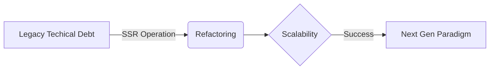

<!-- 🔥🔥🔥🔥🔥🔥🔥 -->

<h1 align="center">
  <div>
    
    
    
  </div>
  <span>🔥 Welcome SINWU's Github 🔥</span>
</h1>

<p align="center">
  
  
  
  <br>
  
</p>

---
<!-- Intro 🫠🫠🫠🫠🫠🫠🫠 -->

# SINWU LOK | SSR Specialist | System Scalable Refactoring


```mermaid
graph LR

    A[Legacy Techical Debt] -- SSR Operation --> B(Refactoring)
    B --> C{Scalability}
    C -->|Success| D[Next Gen Paradigm]

```
---
<!-- Feature Table 📖📝🎓📚👨‍🏫🧪🚀 -->
## Featured Projects

| Project | Description | Status |
|---|---|---|
| [sinwulok](https://github.com/sinwulok/sinwulok) | 📝 Personal profile repository and GitHub identity hub. | Active |
| [credentials](https://github.com/sinwulok/credentials) | 🎓 Certifications, credentials, and selected proof-of-work highlights. | Active |
| [biu1-ai-quant](https://github.com/sinwulok/biu1-ai-quant) | 👨‍🏫 AI quant assistant for personal investment research. | Ongoing |
| [biu1-ragme-github](https://github.com/sinwulok/biu1-ragme-github) | 🧪 Agentic RAG experimentation on GitHub. | Experimental |
| [atlas](https://github.com/sinwulok/atlas) | 🚀 Public repository ecosystem with metadata-driven governance.  | Archived / Portfolio |

> Credentials page: [sinwulok.github.io/credentials/](https://sinwulok.github.io/credentials/)

---
<!-- Tech Stacks -->
## Tech Stack

<p>
  
  
  
  
  
</p>

---
<!-- workflow widgets 🔮🌐🧩🔲✨📊🌀 -->
<!-- Contribute Graph -->
[](https://github.com/ashutosh00710/github-readme-activity-graph)

<!-- GitHub Snake Ocean -->

  
---
<!-- 🛠️🛠️🛠️🛠️🛠️🛠️🛠️ -->
<!-- standard summary format -->
## 🔭 Current Focus

```
- AI / LLM Engineering
- Data Science (Intelligence) > AI & Tokenized Intelligence
- Tokenization Economic > Agentic Tokenized Intelligence Governance
  - (I don't think this direction exists, but it might appear in the future.)

### AI Governance & Tokenized Intelligence (illusionary)
- Data, identity, contribution, and access as tokenized primitives
- AI-mediated systems for decision-making and coordination
- Incentive design, governance, and economic mechanisms
- On-chain and off-chain intelligence workflows
```

---

## 💡 Random Dev Quote

<div align="center">
  
  [](https://github.com/piyushsuthar/github-readme-quotes)
  
</div>

---

## 📫 How to reach me

[](https://www.linkedin.com/in/maximilian-lok/)
[](https://x.com/@SW552i)

