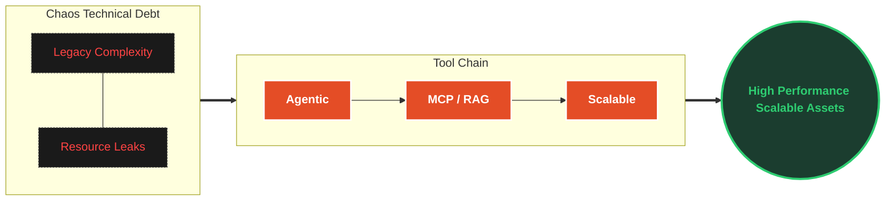

<!-- 🔥🔥🔥🔥🔥🔥🔥 -->

<h1 align="center">
  <div>
    
    
    
  </div>
  <span>🔥 Welcome SINWU's Github 🔥</span>
</h1>

<p align="center">
  
  
  
  <br>
  
</p>

---
<!-- Intro 🫠🫠🫠🫠🫠🫠🫠 -->

# SINWU LOK | SSR Specialist | System Scalable Refactoring


```mermaid
graph LR
    %% 樣式定義
    classDef legacy fill:#1a1a1a,stroke:#444,stroke-width:1px,color:#ff4444,stroke-dasharray: 2 2
    classDef surgeon fill:#e44d26,stroke:#fff,stroke-width:2px,color:#fff,font-weight:bold
    classDef result fill:#1b3d2f,stroke:#2ecc71,stroke-width:3px,color:#2ecc71,font-weight:bold

    %% 區域 1: 熵增混亂
    subgraph Zone_Legacy ["Chaos Technical Debt"]
        A["Legacy Complexity"] --- B["Resource Leaks"]
    end

    %% 區域 2: AI 智能驅動 (L -> R)
    subgraph Zone_Agentic ["Tool Chain"]
        direction LR
        T1[Agentic] --> T2[MCP / RAG] --> T3[Scalable]
    end

    %% 區域 3: 最終成果 (Green Circle)
    R((High Performance Scalable Assets))

    %% 連接邏輯
    Zone_Legacy ==> Zone_Agentic
    Zone_Agentic ==> R

    %% 樣式應用
    class A,B legacy
    class T1,T2,T3 surgeon
    class R result

```
---
<!-- Feature Table 📖📝🎓📚👨‍🏫🧪🚀 -->
## Featured Projects

| Project | Description | Status |
|---|---|---|
| [sinwulok](https://github.com/sinwulok/sinwulok) | 📝 Personal profile repository and GitHub identity hub. | Active |
| [credentials](https://github.com/sinwulok/credentials) | 🎓 Certifications, credentials, and selected proof-of-work highlights. | Active |
| [biu1-ai-quant](https://github.com/sinwulok/biu1-ai-quant) | 👨‍🏫 AI quant assistant for personal investment research. | Ongoing |
| [biu1-ragme-github](https://github.com/sinwulok/biu1-ragme-github) | 🧪 Agentic RAG experimentation on GitHub. | Experimental |
| [atlas](https://github.com/sinwulok/atlas) | 🚀 Public repository ecosystem with metadata-driven governance.  | Archived / Portfolio |

> Credentials page: [sinwulok.github.io/credentials/](https://sinwulok.github.io/credentials/)

---
<!-- Tech Stacks -->
## Tech Stack


 


---
<!-- workflow widgets 🔮🌐🧩🔲✨📊🌀 -->
<!-- Contribute Graph -->
[](https://github.com/ashutosh00710/github-readme-activity-graph)

<!-- GitHub Snake Ocean -->

  
---
<!-- 🛠️🛠️🛠️🛠️🛠️🛠️🛠️ -->
<!-- standard summary format -->
## 🔭 Current Focus

```
- AI / LLM Engineering
- Data Science (Intelligence) > AI & Tokenized Intelligence
- Tokenization Economic > Agentic Tokenized Intelligence Governance
  - (I don't think this direction exists, but it might appear in the future.)

### AI Governance & Tokenized Intelligence (illusionary)
- Data, identity, contribution, and access as tokenized primitives
- AI-mediated systems for decision-making and coordination
- Incentive design, governance, and economic mechanisms
- On-chain and off-chain intelligence workflows
```

---

## 💡 Random Dev Quote

<div align="center">
  
  [](https://github.com/piyushsuthar/github-readme-quotes)
  
</div>

---

## 📫 How to reach me

[](https://www.linkedin.com/in/maximilian-lok/)
[](https://x.com/@SW552i)

